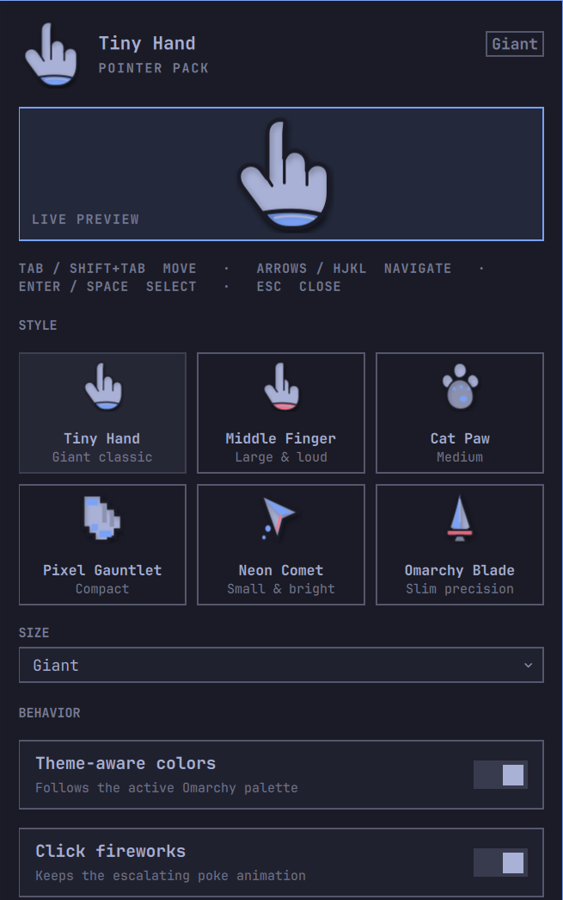

# Tiny Hand for Omarchy

Tiny Hand replaces the ordinary pointer with a pack of expressive,
theme-aware animated pointers for Omarchy and Hyprland. It follows the real
hotspot across monitors, stays click-through, and reacts when you click.

This is an original Linux implementation inspired by expressive presentation
cursors. It contains no Pokey artwork or code and is not affiliated with
Pokey.



## Highlights

- Six original vector styles: Tiny Hand, Middle Finger, Cat Paw, Pixel
  Gauntlet, Neon Comet, and Omarchy Blade
- Four size choices, with per-style proportions so smaller precision pointers
  still stand out
- Theme-aware fill, outline, accent, and click-effect colors
- Four levels of rapid-click energy
- Optional triple-click jazz hands
- A top-right bar menu with live previews, Save, and Reset
- Complete keyboard control with Tab/Shift+Tab, arrows or HJKL, Enter/Space,
  and Escape
- Persistent settings in `~/.config/omarchy/shell.json`
- 60 Hz multi-monitor tracking through Hyprland's local IPC socket
- Click-through Quickshell overlays that never block the desktop
- Automatic native-cursor restoration during any Omarchy menu, panel, or
  Omasnap editor session, plus shutdown, disable, removal, and helper failure
- Runtime-owned click and shortcut bindings: no permanent Hyprland config edit

## Requirements

- Omarchy 4 (Quattro) with `omarchy-shell`
- Hyprland 0.55 or newer with Lua configuration support
- x86-64 Linux for the bundled bridge executable

Tiny Hand does not need root access, membership in the `input` group, access
to `/dev/input`, or a network connection. A C compiler is needed only when
developing or independently rebuilding the bundled helper.

## Install

```bash
omarchy plugin add https://github.com/robbooker/omarchy-tiny-hand.git --enable
```

The Tiny Hand button is placed in the right side of the bar. No additional
configuration or build step is required.

## Use

- Left-click the bar icon to open Settings.
- Middle-click the icon or press `Super+Alt+P` to show or hide the pointer.
- Right-click the icon to cycle pointer styles.
- Triple-click to trigger jazz hands when that setting is enabled.

Inside Settings:

- Tab and Shift+Tab move through every control.
- Arrows or HJKL navigate choices.
- Enter or Space selects.
- Number keys 1–6 select a pointer style.
- `S` saves, `R` resets the draft, and Escape closes the panel.

Opening Settings—or any other Omarchy bar menu—temporarily suspends Tiny Hand
so the native cursor remains visible above the popup. Closing the panel resumes
the chosen pointer without changing its saved enabled state.

Opening Omasnap does the same while its interactive capture editor is on top.
Closing the editor restores the selected Tiny Hand style. Passive Omasnap pins
do not suspend Tiny Hand.

Diagnostics are available through the shell:

```bash
omarchy-shell tiny-hand status
omarchy-shell tiny-hand click
```

## Remove

Use Omarchy's standard removal path:

```bash
omarchy plugin remove robbooker.tiny-hand --yes
```

Normal removal unloads the service, terminates its two helper processes,
removes their exact runtime Hyprland binding handles, and restores the native
cursor. The optional cleanup script also removes configuration left by Tiny
Hand versions older than 0.5:

```bash
~/.config/omarchy/plugins/robbooker.tiny-hand/scripts/uninstall.sh
```

## Privacy and security

Tiny Hand runs unsandboxed like every Omarchy shell plugin, so review the
source before enabling it.

- No network access, analytics, telemetry, or remote dependencies
- No root access and no reads from `/dev/input`
- Cursor coordinates are read only from Hyprland's local Unix socket, retained
  in memory, and never logged or persisted
- A non-consuming live Hyprland binding reports primary-button presses without
  intercepting them
- Runtime bindings are tracked by their individual Lua handles, so shutdown
  removes only Tiny Hand's own bindings
- The native cursor is hidden only with Hyprland's runtime
  `cursor:invisible` setting; no cursor theme is replaced on disk

The bundled x86-64 helper is built from
[`src/tiny-hand-bridge.c`](src/tiny-hand-bridge.c) in a digest-pinned Debian
toolchain. CI rebuilds it and requires byte-for-byte equality with
[`bin/tiny-hand-bridge`](bin/tiny-hand-bridge).

## Development

Build with the host compiler and run the local checks:

```bash
make build
make check
```

Install the current checkout for live development:

```bash
make install
```

Build or verify the committed release helper with Docker:

```bash
make release-build
make verify-bridge
```

`make check` runs the Omarchy manifest validator, bridge tests, publication
tests, and `qmllint`. The release builder uses no network while compiling the
mounted source; its image is constructed from an immutable Debian snapshot.

## Architecture

`Service.qml` owns the click-through pointer windows and two small helper
processes. The stream helper queries Hyprland's local IPC socket for pointer
coordinates, hides and restores the native cursor, and owns the non-consuming
click binding. The sleeping hotkey helper owns `Super+Alt+P` even while the
pointer itself is temporarily hidden. PID ownership tokens prevent a retiring
helper generation from removing a replacement generation's socket, binding,
or cursor state.

`BarWidget.qml` hosts the bar icon and settings panel. `Panel.qml` manages
draft preferences, persistence, and keyboard navigation. `Service.qml` watches
Omarchy's shared popout state and yields to the native cursor while an
interactive panel is open. `PointerArt.qml` contains the original vector art.

## Known limitations

- The bundled release helper currently targets x86-64 Linux.
- Rotated monitors are not handled yet.
- Full-monitor capture should include the overlay; window-only capture usually
  will not.
- A compositor killed with `SIGKILL` cannot execute cleanup, but the next
  Hyprland login restores the runtime cursor state and a new Tiny Hand helper
  replaces stale runtime bindings safely.

## License

Tiny Hand is released under the MIT License. See [LICENSE](LICENSE) and
[THIRD_PARTY_NOTICES.md](THIRD_PARTY_NOTICES.md).
